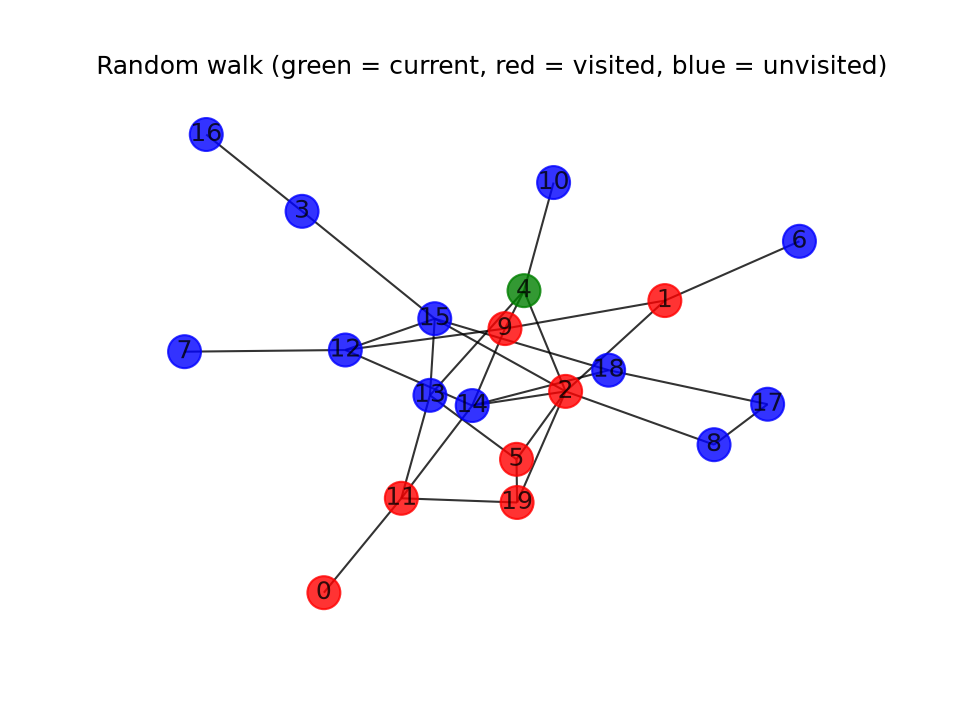

# Random Walks — a Cover Time Explorer

Final project of my Bachelor's degree: a small desktop tool for exploring the
**cover time** of random walks on graphs.

A simple random walk starts at a node and repeatedly moves to a uniformly random
neighbour. Its **cover time** is the number of steps it takes to visit every node of
the graph at least once — a classic quantity in probability theory and theoretical
computer science. For any connected graph with *n* nodes and *m* edges the expected
cover time is at most *2m(n−1)* (Aleliunas et al., 1979), and depending on the graph's
shape it ranges from Θ(*n* log *n*) — e.g. the complete graph, where covering reduces
to the coupon collector's problem — up to Θ(*n*³) in the worst case. This tool lets
you build different graph families and watch how their structure changes the cover
time of an actual walk.



*Example output (`random_walk_2d.png`, generated by the program): a walk in progress
on a G(20, 30) random graph — green is the walker's current node, red nodes have been
visited, blue nodes are still uncovered.*

## What the tool does

1. **Build a graph** — enter the number of nodes and edges (for a **regular** graph,
   the second field is the degree of every node) and click one of the buttons:
   - **Regular Graph** — a random *d*-regular graph
   - **Random Graph** — a G(n, m) random graph
   - **Tree Graph** — a uniformly random labeled tree

   The graph is drawn on screen and saved to `output_graph.txt` (adjacency list).
2. **Run the walk** — close the plot window, then choose **File → Run Random Walk**.
   A random walk runs from node 0 until every node has been visited, then a pop-up
   reports the **cover time** together with the size and density of the graph.
3. **Watch it** — if **Show the walk** is checked, the walk is drawn every ⌊√n⌋ steps
   (blue = unvisited, red = visited, green = current node) and the latest frame is
   saved to `random_walk_2d.png`.

Every step also appends the cumulative per-edge traversal counts to `edge_steps.csv`
(one column per edge, one row per step) — ready for analysing edge occupation in a
spreadsheet or with pandas.

Since a random walk can only cover a connected graph, the program checks
connectivity first and refuses to run on a disconnected graph.

## Installation

Requires Python 3.9+ with Tkinter (bundled with most Python installers; on
Debian/Ubuntu: `sudo apt install python3-tk`).

```sh
pip install -r requirements.txt   # networkx, matplotlib
```

## Running

```sh
python3 gui.py
```

## Project structure

| File | Purpose |
| --- | --- |
| `gui.py` | Tkinter front end: input validation, build buttons, walk menu |
| `graph_builder.py` | Builds the graphs with networkx and saves them to disk |
| `random_walk.py` | The walk itself: runs until the graph is covered, records per-edge counts |
| `walk_view.py` | Live matplotlib visualization of the walk |
